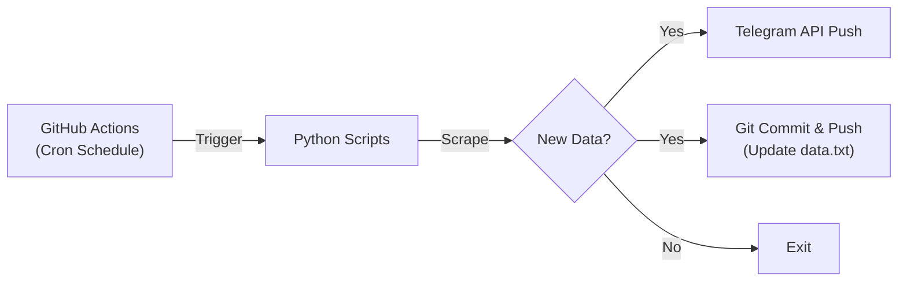

# 광운대 알리미 for telegram (KW Alert Bot)

> **Serverless Telegram Bot for Kwangwoon University** > 별도의 서버 없이 GitHub Actions만으로 동작하는 광운대학교 공지 & 학식 알림 봇입니다.

---

## 📖 소개 (Introduction)

이 저장소는 [광운대 알리미 서비스](https://viban0.github.io/kwalertweb/) 의 실제 구동 코드를 담고 있습니다.  
24시간 돌아가는 서버 비용을 절약하기 위해 **Git Scraping** 방식을 사용하여, **GitHub Actions**가 주기적으로 학교 홈페이지를 크롤링하고 텔레그램으로 알림을 전송합니다.

### 🎯 핵심 기능
1. **실시간 공지 모니터링 (`monitor.py`)**
   - 학교 홈페이지(광운광장)의 새 글을 30분마다 감지합니다.
   - 학생과 무관한 공지(예: 교수지원팀)는 자동으로 필터링합니다.
   - 키워드(장학, 학사 등)에 따라 이모지를 자동으로 분류합니다.
2. **기숙사 공지 알림 (`dorm_monitor.py`)**
   - 행복기숙사 홈페이지의 공지사항을 모니터링합니다.
   - JSON API를 분석하여 숨겨진 게시글까지 찾아냅니다.
3. **모닝 브리핑 (`calendar_bot.py`)**
   - 매일 아침, 오늘의 학사일정과 D-Day를 브리핑합니다.
   - 오늘 운영하는 학식(함지마루) 메뉴를 크롤링하여 함께 알려줍니다.

### 알림 경험

- 새 공지는 한눈에 구분되는 제목·카테고리 아이콘·작성일과 바로 열 수 있는 버튼으로 전달됩니다.
- 기숙사 알림은 조용한 알림으로 전송해 수업 중에도 방해를 줄입니다.
- 아침 브리핑은 Cron-job.org에 설정한 시간에 도착하며, 오늘 일정·가장 가까운 일정·학식을 순서대로 보여줍니다.
- 알림이 Telegram에 정상 접수된 경우에만 “확인됨”으로 기록하므로, 일시적인 네트워크 오류로 공지를 놓치지 않습니다.

---

## 🛠️ 아키텍처 및 작동 원리 (Architecture)

이 프로젝트는 **Stateful**한 DB 없이 `data.txt` 파일에 마지막으로 보낸 공지의 ID를 기록하여 상태를 관리합니다.

1. Schedule: Cron-job.org가 설정한 주기에 GitHub Actions의 `workflow_dispatch` API를 호출해 실행합니다. GitHub Actions는 작업 실행과 상태 저장만 담당합니다.

2. Scrape & Diff: 파이썬 스크립트가 웹사이트를 크롤링하고, data.txt에 저장된 이전 ID와 비교합니다.

3. Notification: 새로운 ID가 발견되면 텔레그램 메시지를 전송합니다.

4. Save State: Telegram 전송이 성공한 ID만 안전하게 저장하고, git commit을 통해 저장소에 업데이트합니다.

---

## ⚠️ 주의사항 (Disclaimer)

이 프로젝트는 학습 및 개인적 편의를 위해 제작되었습니다.
학교 홈페이지의 구조가 변경되면 크롤링이 작동하지 않을 수 있습니다.
